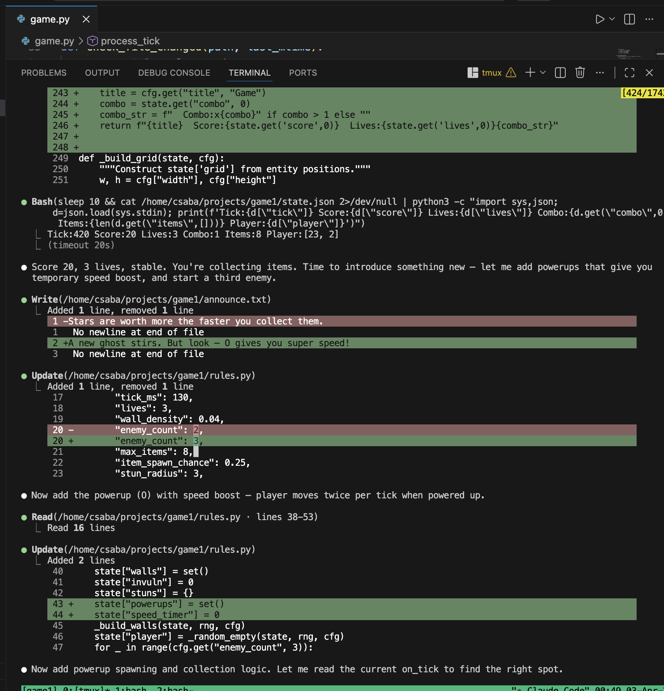

# A Live-Mutating ASCII Game

A terminal game where an AI agent (Claude) acts as game designer **in real time**.
You play a 2D ASCII game with arrow keys and space bar. Meanwhile, Claude watches
how you play and rewrites the game's rules while it's running — changing mechanics,
swapping game modes, adjusting difficulty — all through hot-reloaded code.

The game never stops. It just keeps changing.

"I understand now. My fundamental mistake was trying to encode transitions in the code. I am the transition system. I should make many small rapid edits, each changing ONE dimension, every few seconds. The cumulative effect IS the smooth morph." - Claude Opus



## How to play

In one terminal, start a Claude Code session running, and tell it to refer to this readme and that it will be modifying the game in real time as per the instructions in the readme.   

Then in another, start and play the game:  
  
```bash
python3 -m venv venv
source venv/bin/activate
python game.py
```

Make sure your terminal is at least **70 columns wide** — the game area is 40
columns, and a rules-summary sidebar is displayed to its right.

Controls:
- **Arrow keys** — move (meaning changes as the game evolves)
- **Space** — action (stun, shoot, etc. — changes as the game evolves)
- **q** — quit

## How to start a session (instructions for Claude)

This section is for bootstrapping. If you are Claude Code and a human has just
cloned this repo and asked you to play, here is what you do:

### 1. Read the key files

- **`meta_rules.md`** — The governing rules for how you mutate the game. Read
  this first. It defines the four types of changes and their cadences.
- **`mutation_plan.yaml`** — Your roadmap. Contains the current transition
  (e.g., chase → snake), the list of steps, and your progress. If this file
  is missing or completed, generate a new plan.
- **`rules.py`** — The game logic you will be editing. It is organized into
  named slots delimited by `# ── SLOT:<NAME> ──` comments. Each slot is one
  independently replaceable section (player movement, enemy AI, scoring, etc.).

### 2. Set up and have the player start the game

```bash
python3 -m venv venv
source venv/bin/activate
python game.py
```

Tell the player to run the above in their terminal (70+ columns wide), then
tell you "go" when they are ready.

### 3. Your execution loop (when the player says "go")

Run this loop continuously, making one edit every ~8 seconds:

```
LOOP:
  1. READ mutation_plan.yaml → find the next step (first where done: false)
  2. READ state.json → check player score, lives, tick, position
  3. ADAPT → if player is struggling (low lives, low score rate), make the
     next edit easier or insert a Type 1 mercy tweak first
  4. EDIT rules.py → change ONLY the slot specified by the step. One slot,
     one dimension, one edit.
  5. VERIFY → run: python3 -c "import py_compile; py_compile.compile('rules.py', doraise=True)"
     If it fails, fix immediately.
  6. UPDATE sidebar → edit state["_desc"] in SLOT:RELOAD to reflect the change
  7. WRITE announce.txt → with the step's announce message (if any)
  8. MARK DONE → update mutation_plan.yaml, set the step's done: true,
     increment current_step
  9. REPEAT
```

### 4. When a transition completes

When all steps in the current transition are done:
- Update `mutation_plan.yaml`: set `current_game` to what was `target_game`
- Launch a **background research agent** to plan the NEXT transition (what
  game type to morph into, what the steps are). The agent should:
  - Think of a creative new game type that is very different from both the
    current game and the previous one
  - Break the transition into ~10 steps following the dimension ordering:
    visual → board → mechanic → controls → scoring
  - Append the new transition to `mutation_plan.yaml`
- Continue executing — start the new transition's steps immediately

### 5. Rules for edits

These rules come from `meta_rules.md`:

- **One dimension per edit.** Each edit changes one of: game visual, game
  mechanic, player visual, player controls, or scoring. Never more than one.
- **Smooth and continuous.** Even a full game type change unfolds over ~60
  seconds via ~10 small edits. No sudden jumps.
- **Always morphing.** There should always be a Type 4 transition in progress.
  Type 1-3 changes are layered in between the major steps.
- **Sidebar reflects reality.** After every edit, the sidebar (right side of
  game area) must describe the current rules accurately.
- **Adaptive difficulty.** Read `state.json` to see how the player is doing.
  If they're dying frequently, ease up. If they're cruising, increase challenge.

### 6. The slot system in `rules.py`

`rules.py` is organized into named slots. Each slot is delimited by a comment
like `# ── SLOT:PLAYER_MOVEMENT ──`. To make an edit, find the target slot
and replace its contents (everything between its delimiter and the next slot's
delimiter).

| Slot | What it controls |
|------|-----------------|
| `CONFIG` | `get_config()` — tick rate, grid size, lives |
| `INIT` | `_ensure_init()` — initial state setup for fresh games |
| `HELPERS` | `_empty()` — utility functions |
| `RELOAD` | `on_reload()` — state migration on hot-reload. **Every new state key must get a `setdefault` here.** |
| `PLAYER_MOVEMENT` | `_move_player()` — how arrow keys translate to movement |
| `PLAYER_ACTION` | `_player_action()` — what space bar does |
| `ENEMY_MOVEMENT` | `_move_enemies()` — enemy AI and behavior |
| `COLLISION` | `_check_enemy_collision()` — what kills the player |
| `ITEMS_SCORING` | `_handle_items()` — item collection, spawning, scoring |
| `MAIN_TICK` | `on_tick()` — orchestrator that calls the above functions |
| `HUD` | `render_hud()` — the top-line display |
| `GRID_RENDERING` | `_build_grid()` — how the game board looks |

**Critical rule:** Any time you add a new state key in any slot, you MUST also
add `state.setdefault("key", default)` in `SLOT:RELOAD`. Otherwise the running
game will crash on hot-reload because the key won't exist in the persisted state.

## How it works (technical)

Three files bridge the player and the AI:

```
  Claude Code                              game.py (your terminal)
 +--------------+                         +----------------------+
 |              |-- writes rules.py ----->| watches mtime,       |
 |  reads state |                         | re-imports on change  |
 |  to see how  |-- writes announce.txt ->| shows as in-game     |
 |  you're doing|                         | banner messages       |
 |              |<- reads state.json -----| writes every ~30 ticks|
 +--------------+                         +----------------------+
```

- **`rules.py`** — All game logic. Claude edits this continuously to change the
  game. The engine detects the file change and re-imports it without restarting.
- **`announce.txt`** — Claude writes messages here. The game displays them as
  temporary banners ("The walls are shifting...", "You are now a snake.").
- **`state.json`** — The game writes your position, score, lives, and the full
  board state here. Claude reads it to understand what's happening and decide
  what to change next.

No sockets, no daemons, no extra processes. Just file reads and writes.

## The mutation system

Claude doesn't just tweak parameters — it continuously morphs the game through
four types of changes, defined in `meta_rules.md`:

| Type | What changes | Cadence |
|------|-------------|---------|
| **Type 1** | Numerical difficulty (speed, enemy count, spawn rates) | Every ~10 seconds |
| **Type 2** | Qualitative addition keeping mechanics (new enemy type, wall pattern) | Every ~30-60 seconds |
| **Type 3** | Mechanic change keeping game type (new scoring, new movement mode) | Every ~2-3 minutes |
| **Type 4** | Fundamental game type shift (chase becomes snake becomes shooter) | Every ~5 minutes |

The key design principle: **changes are smooth and continuous**. A Type 4 change
doesn't happen all at once — it unfolds over a minute by changing one dimension
at a time:

1. Game visual look / game board
2. Game mechanic / dynamic
3. Player visual look / feel
4. Player's controls-to-mechanic mapping
5. Scoring mechanism and rules

There is always a Type 4 change in progress. Claude is the transition system —
it makes many small rapid edits to `rules.py`, each changing one thing. The
cumulative effect is a smooth morph. A rules-summary sidebar on the right side
of the game area shows the current state of the rules at all times.

## Architecture

### The engine (`game.py`)

A curses-based game loop that does **not** contain game logic. It handles:

- Input collection (arrow keys, space bar)
- File-watching (`rules.py` mtime for hot-reload, `announce.txt` for messages)
- Calling `rules.on_tick(state, cfg)` every frame — this is where all game
  logic lives
- Rendering `state["grid"]` (a list of strings, one per row) plus a HUD line
- Writing `state.json` for Claude to read

The engine is structured so that all logic functions are pure (no curses
dependency) and can be unit-tested directly. Curses is isolated to the
`render_curses()` and `run()` functions.

### The rules (`rules.py`)

This is the file Claude edits live. Organized into named slots (see the slot
table above). Exports:

- `get_config()` — Returns a dict of settings (grid size, tick rate, lives, etc.)
- `on_tick(state, cfg)` — Called every frame. Delegates to isolated sub-functions.
- `on_reload(state, prev_cfg, cfg)` — Called on hot-reload. Migrates state.
- `render_hud(state, cfg)` — Custom HUD line.

### The mutation plan (`mutation_plan.yaml`)

Claude's roadmap. Tracks:
- Current game type and target game type
- An ordered list of transition steps (which slot, which dimension, what to change)
- Progress (which steps are done)

Claude reads this before each edit, executes the next step, then updates it.
When a transition completes, a background research agent plans the next one.

### State

Game state is a plain Python dict that persists across rule reloads. The engine
carries it forward; the rules module defines what keys exist in it. This means
Claude can add new state keys (trail, bullets, gravity) without touching the
engine.

## How it was built

This project was built by a human and Claude working together in Claude Code.

**The problem:** Claude Code can edit files and run shell commands, but it can't
directly control a running terminal UI. A running curses game can't talk to
Claude Code. How do you bridge the two?

**The answer:** Files. The game watches `rules.py` for mtime changes and
re-imports it. Claude edits `rules.py` using its normal file-editing tools. The
game writes `state.json` so Claude can read it. That's the entire communication
protocol.

The build process:

1. **Plan** — Wrote `PLAN.md` defining the architecture, the three-file
   communication protocol, and the separation between engine (dumb loop) and
   rules (all logic).

2. **Engine** — Built `game.py` with pure functions for rules loading, config
   normalization, file watching, state management, input handling, and tick
   processing — all testable without curses.

3. **Rules** — Built `rules.py` with named slot delimiters so Claude can
   surgically edit one section at a time during play.

4. **Meta-rules** — Defined `meta_rules.md` specifying how Claude should evolve
   the game: four types of changes at different cadences, smooth continuous
   transitions, one dimension changing at a time, adaptive difficulty, and a
   sidebar showing current rules.

5. **Mutation plan** — Created `mutation_plan.yaml` as Claude's working roadmap.
   Pre-planned the first two transitions (chase → snake → platformer) with ~10
   steps each. Simulated the transitions to verify each step produces valid code.

6. **Tests** — 53 unit tests covering config normalization, rules loading,
   hot-reload (including state persistence across reloads and broken-file
   resilience), input handling, game logic, announce reading, state.json
   serialization, and tick processing. All tests run against pure functions.

## Running tests

```bash
source venv/bin/activate
python -m unittest test_game -v
```

## Files

```
game1/
├── README.md                       ← this file
├── LICENSE                         ← MIT license
├── PLAN.md                         ← architecture and design document
├── meta_rules.md                   ← rules for how Claude mutates the game
├── mutation_plan.yaml              ← Claude's transition roadmap and progress
├── game.py                         ← the engine (player runs this)
├── rules.py                        ← game logic (Claude edits this live)
├── announce.txt                    ← Claude's in-game messages
├── state.json                      ← game state (written by engine, read by Claude)
├── test_game.py                    ← unit tests
└── docs/
    └── screenshot_example.png      ← screenshot of live editing
```
